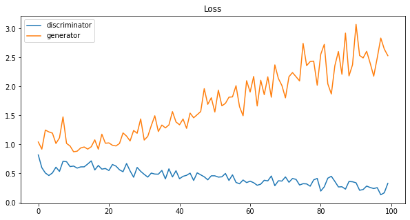
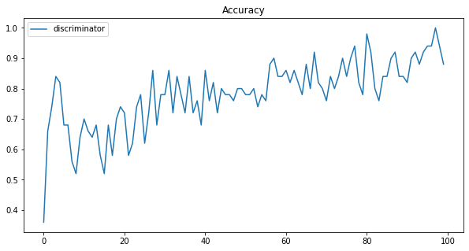
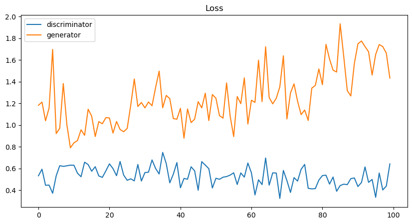
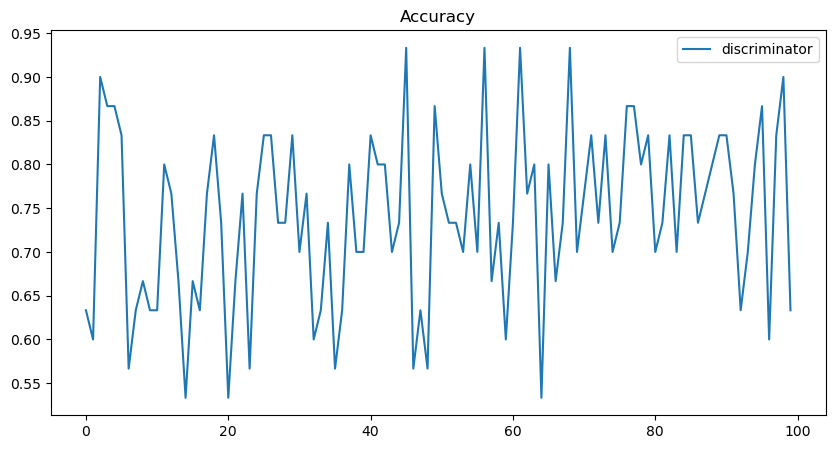
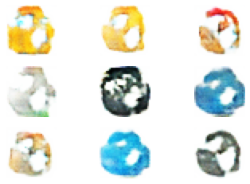
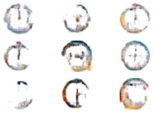
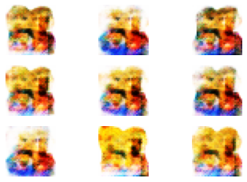
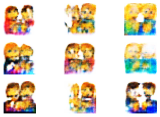

# Icon Generation with Conditional GANs

This repository contains the code for the paper [Icon Generation with Conditional GANs](paper/article.pdf)
by [Diogo Medeiros](https://github.com/Necas209).

## Abstract

Conditional Generative Adversarial Networks (cGANs) were used to generate icons with specific characteristics or
properties given the Icons-50 dataset.

The performance of the cGANs was impacted by the imbalanced nature of the original dataset.
Filtering the original dataset to include only the 10 most frequent classes (the Icons-10 dataset) improved the
performance of the cGANs, allowing them to generate more detailed and striking icons.

This paper demonstrates the potential of cGANs for use in applications where a large number of icons with specific
characteristics are needed.

## Usage

### Requirements

- Python 3.8+
- TensorFlow 2.9.x
- Hydra Core 1.1.x

### Configuration

The configuration files are located in the `config` directory. The `config.yaml` file contains the default configuration
for the project. For more information on how to use Hydra, please refer to
the [documentation](https://hydra.cc/docs/next/).

The configuration file contains the following parameters:

- Parameters for the model architecture and data preprocessing:
- `latent_dim`: The dimensionality of the latent space.
- `image_size`: The size of the images in the dataset.
- `channels`: The number of channels in the images in the dataset.
- `num_classes`: The number of classes in the dataset.
- `batch_size`: The batch size for training.
- `epochs`: The number of epochs for training.
- `top_k`: The number of classes to use in the dataset. If set to 0, all classes are used.
- `shuffle`: Whether to shuffle the dataset.

- Parameters for the training process:
- `lr`: The learning rate for the Adam optimizer.
- `beta_1`: The beta_1 parameter for the Adam optimizer.

- Parameters for the model and dataset paths:
- `data_path`: The path to the dataset.
- `classes_path`: The path to the file containing the class names.
- `save_path`: The path to save the model checkpoints.
- `filt_save_path`: The path to save the model checkpoints for the filtered dataset.

### Training

To train a model, run the following command:

```bash
python train.py
```

### Generation

To generate icons, run the following command:

```bash
python test.py
```

## Results

### Metrics

The following metrics were used to evaluate the performance of the cGANs:

- **Binary Cross-Entropy**: The binary cross-entropy loss function used to train the cGANs.
- **Binary Accuracy**: The binary accuracy metric used to train the discriminator.

|                          Loss                           |                          Accuracy                          |
|:-------------------------------------------------------:|:----------------------------------------------------------:|
|  |  |
|  |  |

### Generated Icons

The following icons were generated by the cGANs:

| Class  |                        Icons-50                        |                        Icons-10                        |
|--------|:------------------------------------------------------:|:------------------------------------------------------:|
| Clock  |   |   |
| Family |  |  |

## License

This project is licensed under the MIT License - see the [LICENSE](LICENSE) file for details.

## Acknowledgments

This project was developed as part of the
class [Deep Learning](https://www.utad.pt/estudar/cursos/engenharia-informatica-2/) at [UTAD](https://www.utad.pt/), in
the context of the [Mestrado em Engenharia Informática](https://www.utad.pt/estudar/cursos/engenharia-informatica-2/).

## Cite this work

```bibtex
@misc{Medeiros2023Icon,
    title = {Icon Generation with Conditional GANs},
    author = {Diogo Medeiros},
    year = {2023},
}
```